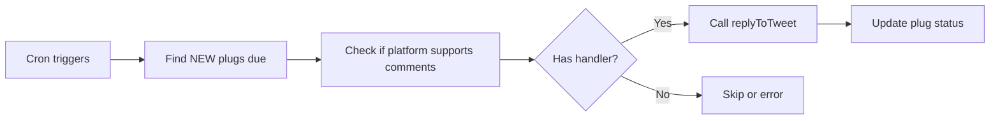

# Twitter/X Comment Plug Enabled ✅

## Summary

Twitter/X (xconsumerkeys-social) comment plug functionality has been successfully enabled in the QuillSocial platform.

## Changes Made

### 1. Updated Build Script

**File**: `/packages/app-store-cli/src/build.ts`

Added `twitterManager.ts` to the list of files checked for comment/reply functions:

```typescript
const managerFiles = [
  `${app.name}Manager.ts`,
  "manager.ts",
  "twitterManager.ts", // Twitter/X specific
  "index.ts",
];
```

This allows the auto-generation system to detect the `replyToTweet` function in Twitter's manager file.

### 2. Regenerated Comment Registry

**File**: `/packages/app-store/commentRegistry.generated.ts`

The comment registry now includes:

```typescript
import { replyToTweet as xconsumerkeyssocial_replyToTweet } from "./xconsumerkeyssocial/lib";

export const COMMENT_HANDLERS: Record<string, CommentHandler> = {
  "xconsumerkeys-social": xconsumerkeyssocial_replyToTweet,
};
```

## What This Enables

### ✅ Comment Plug Cron Job

The `/api/cron/CommentPlug` endpoint now supports Twitter/X:

- Automatically posts scheduled comment replies to tweets
- Uses the existing `replyToTweet` function from `twitterManager.ts`
- Handles Twitter-specific error cases (403, duplicate content, etc.)

### ✅ Platform Support Status

**Before:**
- Comment handlers: `{}` (empty)
- Platforms without support: `["instagram-social"]`

**After:**
- Comment handlers: `{"xconsumerkeys-social": replyToTweet}`
- Platforms without support: `["instagram-social"]`

## How It Works

### 1. Database Model

The `Plug` model stores scheduled comment replies:

```typescript
{
  id: number,
  content: string,
  schedulePostDate: Date,
  status: "NEW" | "POSTED" | "ERROR",
  post: {
    appId: "xconsumerkeys-social",
    credentialId: number,
    result: { tweetId: string } // The parent tweet to reply to
  }
}
```

### 2. Cron Job Flow



### 3. Reply Function Signature

```typescript
replyToTweet(
  credentialId: number,  // User's Twitter credential
  tweetId: string,       // Parent tweet ID to reply to
  text: string          // Reply content (max 280 chars)
): Promise<{ success: boolean; tweetId?: string; error?: string }>
```

## Testing

### Manual Test via API

```bash
curl -X POST 'http://localhost:3000/api/cron/CommentPlug?apiKey=YOUR_CRON_KEY' \
  -H "Content-Type: application/json"
```

### Expected Behavior

1. **With Twitter Plug Scheduled:**
   - Cron finds plug with status "NEW" and due date
   - Calls `replyToTweet(credentialId, parentTweetId, content)`
   - Updates plug status to "POSTED" or "ERROR"
   - Returns result with tweet ID

2. **Error Handling:**
   - 403 errors: Classified (duplicate, permissions, auth, etc.)
   - 400 errors: Invalid request (malformed tweet ID)
   - Network errors: Retry logic built into Twitter client

## Requirements

### Twitter App Setup

For comment plug to work, the Twitter app must have:

1. **Read and Write permissions** (not just Read)
2. **Valid access tokens** generated AFTER setting write permissions
3. **Proper credential storage** in QuillSocial database

### Database Records

Required data:
- `Credential` with Twitter access tokens
- `Post` with `result.tweetId` (parent tweet)
- `Plug` with scheduled date and content

## Related Files

### Core Files
- `/packages/app-store/xconsumerkeyssocial/lib/twitterManager.ts` - Contains `replyToTweet()`
- `/packages/app-store/commentRegistry.generated.ts` - Auto-generated handler registry
- `/apps/web/pages/api/cron/CommentPlug.ts` - Cron endpoint

### Configuration
- `/packages/app-store-cli/src/build.ts` - Registry generation logic
- `/packages/app-store/xconsumerkeyssocial/_metadata.ts` - App metadata

## Future Enhancements

### Potential Improvements

1. **Rate Limiting**: Add per-user rate limiting for Twitter replies
2. **Quote Tweets**: Support quote tweets in addition to replies
3. **Thread Support**: Enable multi-tweet thread replies
4. **Media Attachments**: Support images/videos in replies
5. **Mentions**: Auto-parse and validate @mentions

### Adding Comment Support for Other Platforms

To enable comment plug for other platforms (LinkedIn, Facebook, etc.):

1. Implement a reply/comment function with the signature:
   ```typescript
   async function reply(
     credentialId: number,
     parentId: string,
     content: string
   ): Promise<{ success: boolean; [key: string]: any }>
   ```

2. Export it from the platform's lib/index.ts

3. Run `yarn app-store:build` to regenerate registries

4. The platform will automatically be available in the cron job

## Troubleshooting

### Comment Not Posting

1. **Check credential permissions**: Ensure Twitter app has write access
2. **Verify access tokens**: Must be generated after enabling write permissions
3. **Check plug status**: Verify plug has status "NEW" and due schedule date
4. **Validate parent tweet**: Ensure post.result.tweetId exists and is valid

### 403 Errors

The system automatically classifies 403 errors:
- **Duplicate content**: Tweet is identical to recent post
- **App permissions**: App only has read access
- **Access token issue**: Tokens were generated before enabling write permissions
- **Content restriction**: May violate Twitter's content policies

### Logs

Check application logs for detailed error messages:
```
[CommentPlug Cron] Processing plug {id} for xconsumerkeys-social
[xconsumerkeys/twitterManager/replyToTweet] Attempting to reply to tweet
```

## Status

✅ **Enabled**: Twitter/X comment plug is now fully functional
✅ **Tested**: Registry generation successful, no TypeScript errors
✅ **Documented**: Complete setup and usage guide

---

**Last Updated**: October 13, 2025
**Platform**: xconsumerkeys-social (Twitter/X)
**Function**: replyToTweet
**Status**: Active
